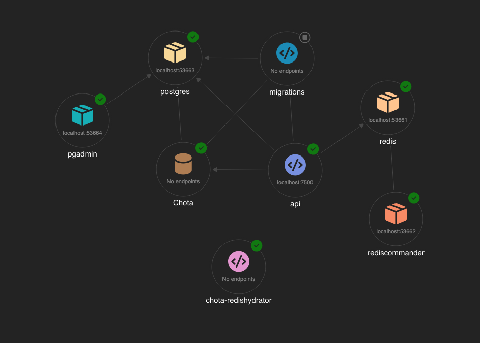
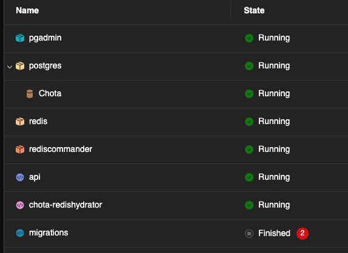

# Chota

The URL shortening service written in C# .NET 9

## Design



Chota is a URL shortening service. The various components that make it up are:

1. API:
   - Exposes RESTful endpoints for URL shortening and redirection
   - The API relies on PosgreSQL for persistence
   - It uses Redis for caching
   - Given a `LongUrl`, it generates a unique `ShortCode` that maps to the LongUrl

2. PostgreSQL - Chota:
   - Provides persistent storage for URL mappings to shortCodes
   - Supports efficient querying and retrieval

3. Redis:
   - Redis provides an efficient caching layer
   - It improves performance and reduces database load

4. Migrations:
   - Handles database schema changes and versioning
   - Ensures smooth upgrades and rollbacks
   - It uses [EntityFramework Core Migrations](https://learn.microsoft.com/en-us/ef/core/managing-schemas/migrations) and is a standalone console application

5. Chota-redishydrator (tbd):
    - A background service that synchronizes data between PostgreSQL and Redis
    - The idea with this was to ensure at startup to preload the cache with existing URL mappings

The whole solution is built on top of [.NET Aspire](https://learn.microsoft.com/en-us/dotnet/aspire/get-started/aspire-overview) so it allows for easy local orchestration and development. I also ship PgAdmin and RedisCommander for easy UI access to the data layer. 

See the URLs in the Resources tab on the [Aspire Dashboard](https://localhost:17024/).

## Prerequisites

You will need the following to run Chota:

- [.NET 9 SDK](https://dotnet.microsoft.com/en-us/download/dotnet) 
- [Docker](https://www.docker.com/)
- [Aspire CLI](https://learn.microsoft.com/en-us/dotnet/aspire/cli/install) `curl -sSL https://aspire.dev/install.sh | bash`

## Getting Started

1. Clone the repository
2. Run `dotnet tool restore` to restore the tools
3. Run `dotnet workload restore` to install the required workloads
4. Run `aspire run` to start the services

## Usage

1. Ensure Aspire Dashboard is up & running and all the services are ready with `aspire run` (you'll need [Aspire cli ](https://learn.microsoft.com/en-us/dotnet/aspire/cli/overview) from above):\
  
2. Access the API at `https://localhost:7500/`
3. Explore the API using the [Scalar UI](https://scalar.com/)
4. Interact with the API endpoints as needed
5. We ship _[Redis Commander](http://localhost:53662/)_ as well as _[pgAdmin](http://localhost:53664/)_ for an in-browser database management experience; browse to the UI from the Aspire Dashboard

## Development Commands

### Building and Running

```bash
# Restore dependencies
dotnet restore

# Build the solution
dotnet build

# Run with Aspire orchestrator (recommended for development)
aspire run
```

### Testing

```bash
# Run all tests
dotnet test

# Run tests with specific verbosity
dotnet test --verbosity normal

# Run tests without building first
dotnet test --no-build
```

### Database Operations

```bash
# Install EF Core tools (if not already installed)
dotnet tool restore

# Add new migration
dotnet ef migrations add <MigrationName> --project src/Chota.Api

# Update database (usually handled by MigrationService)
dotnet ef database update --project src/Chota.Api
```

## Url Shortening Implementation details

### Lookup Strategy

I have chosen a 3-tier store approach:

- In-memory
- Redis
- PostgreSQL

Inside the application, the flow for URL shortening is as follows:

1. **In-memory**: Initially, the service checks the in-memory store for the shortened URL. This provides the fastest access time. I use a `ConcurrentDictionary` for storage here allowing for thread-safe reads & writes.
2. **Redis**: If the URL is not found in-memory, the service queries Redis. This is still quite fast and helps reduce the overall load on the database.
3. **PostgreSQL**: Finally, if the URL is not found in either of the above stores, the service queries PostgreSQL. This is the slowest option but provides persistent storage.

This 3-tier approach ensures that the most frequently accessed URLs are served quickly, while still providing a fallback to persistent storage when needed.

#### Synchronization Issue

This approach introduces some complexity, particularly around cache invalidation and ensuring data consistency across the different storage layers. If a URL is updated or deleted, all three stores need to be updated accordingly to prevent stale data from being served. I haven't implemented this yet, but it's something to consider for future improvements as eventually consistent.

### Short Url Generation

In order to generate a short URL, I have considered several approaches. I'll go into the details about them here.

#### Long Url Hash

The valid URL space of characters is infinite. To lookup efficiently in this space, we need to be able to encode this LongUrl to a reasonable hash which should have the following properties:

1. **Uniqueness**: Each LongUrl should map to a unique short URL.
2. **Determinism**: The same LongUrl should always generate the same short URL.
3. **Compactness**: The short URL should be significantly shorter than the LongUrl.

There isn't a security concern at this level; because all we are looking to do is to hash a user presented LongUrl to enable us to key it uniquely. Hence, no need for a cryptographically strong hash. I originally started with SHA1 for this. But evaluating between MD5, SHA1 & FNV-1a, I settled on FNV-1a for its speed and simplicity. It meets all the above requirements too. So for example:

Given the LongUrl of this repository: "https://github.com/aateeque/chota" the hash is: "1F7C1923DCD9E586"

#### Short Code Generation

The hash of a LongUrl is 16 characters wide & does not look appealing. We want the following properties of our shortCode:

1. **Uniqueness**: Each LongUrl should map to a unique short URL; guaranteeing no duplicates.
2. **Compactness**: The short URL should be significantly shorter than the LongUrl.
3. **Readability**: The short URL should be easy to read and share.
4. **Simplicity**: The short URL should be simple and not contain any complex or confusing elements.
5. **Allowed characters**: The short URL should only contain a limited set of characters: [a-zA-Z0-9] i.e. alphanumeric characters.
6. **Length**: The short URL should have a shortest length possible.

Given the scale of our problem: a 100 million URL's generated per day, 1,160 writes per second, we want to ensure we have a stateless architecture that can handle this load efficiently. With this in mind, we want to have a mechanism that gives global uniqueness to a given LongUrl. 

##### Approaches

I considered the following approaches to this problem:

1. A database incremented counter could be used to generate unique IDs for each LongUrl, which can then be encoded into the short URL. But this means a bottleneck on the database. Hence, is not the right approach.
2. A hash-based approach could be used, where a hash of the LongUrl is generated and then encoded into the short URL. This approach is more scalable but could result in hash collisions and results in wider short URLs.
3. A [UUID (Universally Unique Identifier)](https://www.rfc-editor.org/rfc/rfc9562.html) could be generated for each LongUrl, which can then be encoded into the short URL. This approach is more scalable but results in longer short URLs.
4. A distributed unique ID generator like [Twitter's Snowflake Id](https://en.wikipedia.org/wiki/Snowflake_ID) could be used to generate unique IDs for each LongUrl, which can then be encoded into the short URL.

##### Implementation

I went with #4 as it meets all the requirements. It is scalable, provides global uniqueness, and results in reasonably compact short URLs. But the design is simple enough to allow us to switch to different implementations and see the impact on performance and scalability. We would need to only change the algorithm inside `IdGeneratorService.GenerateNextId`. We could also plug different implementations by swapping out the implementations using feature flags in the future.

After generating an ID for a given LongUrl, I encode it to base62 to get the final short URL. This leads me a `ShortCode` which is the actual reference to the LongUrl.

##### Database Design

I inententionally have remained very lean on my database storage to keep the data persisted small in order to meet our 10-year retention requirement. So I only persist the `ShortUrl` entity which has all the necessary data on it. I went with using the `long Id` from above as the primary key. Although this could be improved in a future version to instead just use `ShortCode` as the primary key.

I also apply a uniqueness constraint on the `LongUrl` field. This helps guarantee that I have no duplicates in the system. As in the case of distributed APIs running concurrently, it is possible to generate 2 different Snowflake IDs for the same LongUrl, however when we try to persist the two entities the first one wins, and we return the persisted object back. This ensures Consistency.

### CAP considerations - CA

Our system is distributed across Redis, PostgreSQL and our API service. We can run many nodes of the API service to help achieve scale, similarly we can run many nodes of Redis to help fan-out the load. However, we need to be mindful of the trade-offs between Consistency, Availability, and Partition Tolerance.

In our case, we prioritize Availability and Consistency over Partition Tolerance. This means that in the event of a network partition, Redis being unavailable for example, we allow for some level of inconsistency in the data, but we ensure that the system remains available for reads and writes.

To implement this fully, as noted above, we would perform background reconciliation to ensure that any inconsistencies are resolved over time. We also leverage the unique constraints in our database to help prevent duplicate entries and maintain data integrity.

### Future Work

As noted above, there is work to be done around consistency in the system. We would implement a background service that would reconcile data between Redis and PostgreSQL to ensure that any inconsistencies are resolved over time.
There is also a bit of work that can be done on the Web UI. The current `Chota.Web` project is the scaffolded ASP.NET Core project that provides a basic web interface for the URL shortener. We could replace this with a proper React App for URL shortening.

Similarly, allowing users to specify their own shortUrls would be a valuable feature to implement.

Asides this, benchmark test suites, using [BenchmarkDotNet](https://github.com/dotnet/BenchmarkDotNet) would be a good area to invest in. So that with each change we would be able to measure & report on performance metrics. I would also work on enhancing the test suite. The integration tests require a bit of work. It would be better to run several types of integration tests against running PostgreSQL and Redis instances. This is currently pending. I also intend to use [NBomber](https://nbomber.com/) for load testing in the future.
